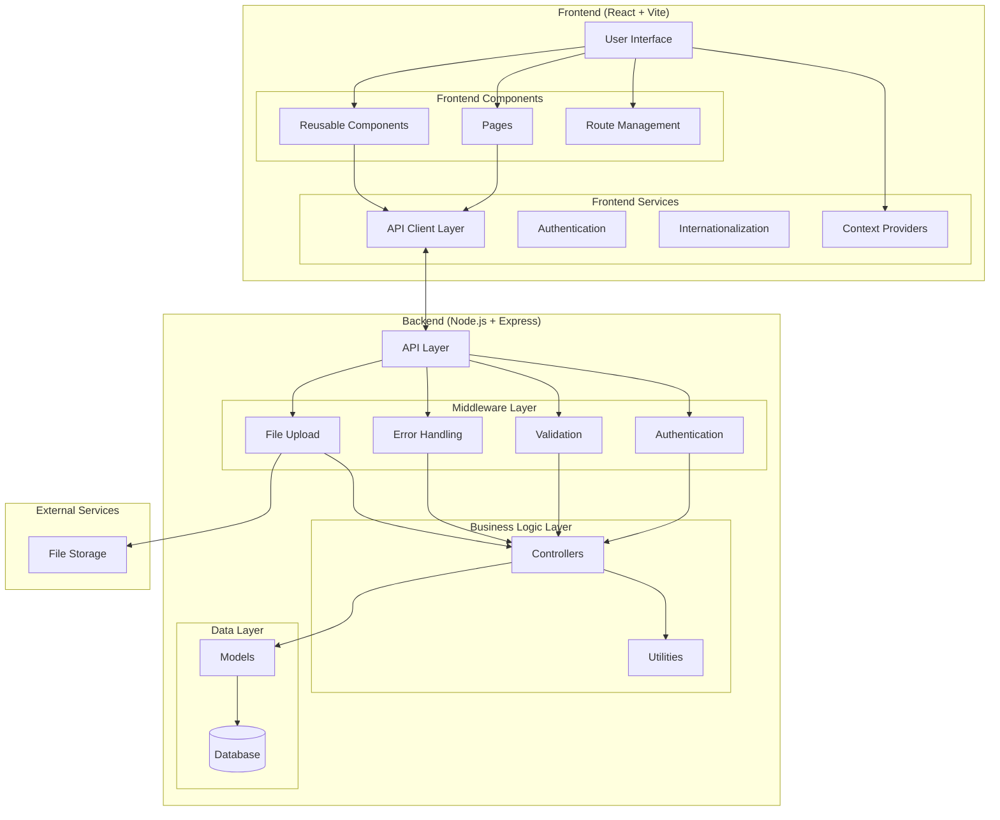

```mermaid
graph TB
    subgraph "Frontend (React + Vite)"
        UI[User Interface]
        subgraph "Frontend Components"
            Pages[Pages]
            Components[Reusable Components]
            Routes[Route Management]
        end
        subgraph "Frontend Services"
            APIClient[API Client Layer]
            Auth[Authentication]
            i18n[Internationalization]
            Context[Context Providers]
        end
        UI --> Pages
        UI --> Components
        UI --> Routes
        Pages --> APIClient
        Components --> APIClient
        UI --> Context
    end

    subgraph "Backend (Node.js + Express)"
        API[API Layer]
        subgraph "Middleware Layer"
            AuthMW[Authentication]
            ValidateMW[Validation]
            ErrorMW[Error Handling]
            UploadMW[File Upload]
        end
        subgraph "Business Logic Layer"
            Controllers[Controllers]
            Utils[Utilities]
        end
        subgraph "Data Layer"
            Models[Models]
            DB[(Database)]
        end
        API --> AuthMW
        API --> ValidateMW
        API --> ErrorMW
        API --> UploadMW
        AuthMW --> Controllers
        ValidateMW --> Controllers
        ErrorMW --> Controllers
        UploadMW --> Controllers
        Controllers --> Models
        Models --> DB
        Controllers --> Utils
    end

    APIClient <--> API

    subgraph "External Services"
        FileStorage[File Storage]
    end
    
    UploadMW --> FileStorage
```
