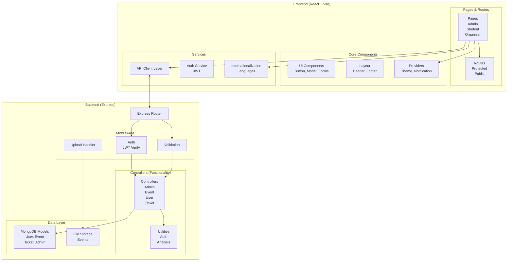

```mermaid
graph TB
    subgraph "Frontend (React + Vite)"
        subgraph "Pages & Routes"
            Pages[Pages<br/>Admin<br/>Student<br/>Organizer]
            Routes[Routes<br/>Protected<br/>Public]
            Pages --> Routes
        end

        subgraph "Core Components"
            UI[UI Components<br/>Button, Modal, Forms]
            Layout[Layout<br/>Header, Footer]
            Context[Providers<br/>Theme, Notification]
        end

        subgraph "Services"
            API_Client[API Client Layer]
            Auth[Auth Service<br/>JWT]
            I18N[Internationalization<br/>Languages]
        end

        Pages --> API_Client
        Pages --> Context
        Pages --> I18N
    end

    subgraph "Backend (Express)"
        Router[Express Router]

        subgraph "Middleware"
            Auth_MW[Auth<br/>JWT Verify]
            Valid_MW[Validation]
            Upload_MW[Upload Handler]
        end

        subgraph "Controllers (Functionality)"
            Controllers[Controllers<br/>Admin<br/>Event<br/>User<br/>Ticket]
            Utils[Utilities<br/>Auth<br/>Analysis]
        end

        subgraph "Data Layer"
            Models[MongoDB Models<br/>User, Event<br/>Ticket, Admin]
            Storage[File Storage<br/>Events]
        end

        Router --> Auth_MW & Valid_MW
        Auth_MW & Valid_MW --> Controllers
        Controllers --> Models & Utils
        Upload_MW --> Storage
    end

    API_Client <--> Router

```
